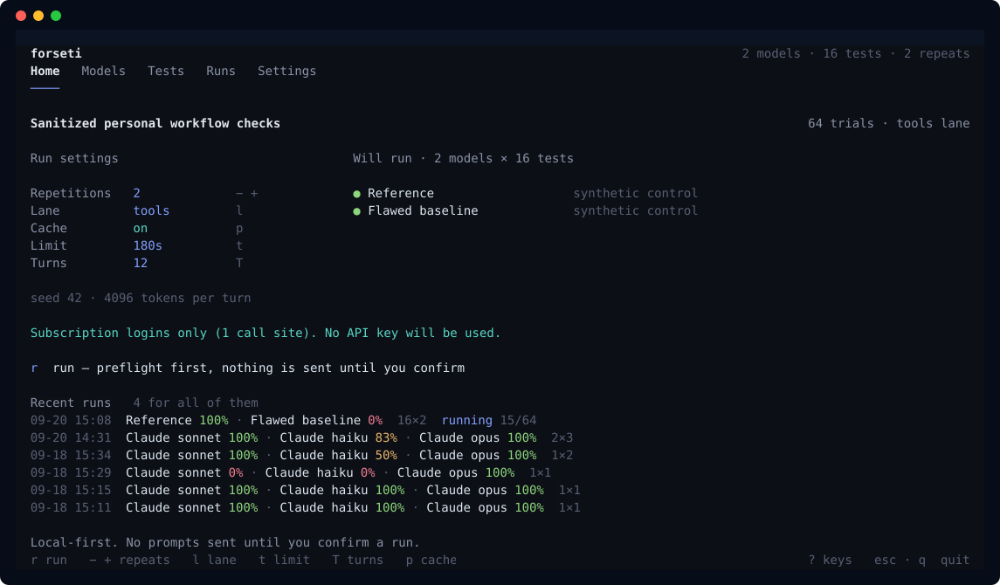

# Forseti

**A small, evidence-first LLM benchmark with a Pi-powered terminal UI.**

Two independent parts:
- **`src/`** — reusable runner, CLI, TUI, isolation, accounting and comparisons.
- **`suites/personal/`** — eleven sanitized tasks, public fixtures and private deterministic verifiers. No framework imports.

## Start

Requires **macOS**, **Node 24+**, and **Python 3** installed through Homebrew, `/usr`, or `/Library`. Other operating systems fail closed; there is no unsandboxed fallback.

```sh
cd /path/to/forseti
mkdir -p .tmp
TMPDIR="$PWD/.tmp" npm ci
npm start                 # TUI; opening it never sends a model prompt
npm run demo              # 36 synthetic control trials, no provider needed
npm run doctor            # exercise the real sandbox; inspect auth metadata
```



**Keys:** `Tab` / `1–4` change views; arrows or `j/k` navigate; `Space` enables/selects; `a` adds; `d` removes after confirmation. In Tests, `u` restores the last removed test. `+/-` changes repetitions; `l` switches tools/prompt lanes; `p` toggles prompt caching. `r` reviews a run before starting. `Esc` cancels while saving results. In Runs: `c` compares, `Enter` inspects evidence, `e` exports.

Defaults are synthetic controls, two repetitions, seed 42, 90 seconds/trial, 12 turns, 4,096 output tokens/turn and **prompt caching on**. **Controls are not LLM rankings.**

## Run a real model

Use the model picker, or:

```sh
npm start -- models catalog openai-codex
npm start -- models add openai-codex/gpt-5.5 --auth pi
npm start -- run --models openai-codex-gpt-5-5 --tests shared-count,incident-window --repeat 2
```

`pi` reads existing `~/.pi/agent/auth.json` **without writing, refreshing or rotating it**. Pi's supported provider implementation makes the request. Tokens within five minutes of expiry are refused; renew them in your normal Pi session yourself, then retry. No credential files are copied into trials, results or prompts. Shell-command credentials are refused.

## Use your Claude plan

Claude models run through **your own Claude Code CLI**, under the login you already have:

```sh
npm start -- models add claude-code/sonnet
npm start -- models add claude-code/haiku
npm start -- run --models claude-code-sonnet,claude-code-haiku --tests shared-count,incident-window --repeat 3
```

No API key, no `--allow-metered`. Forseti spawns the first-party client (`claude -p`) in the trial directory and lets it authenticate itself — it never reads, copies or refreshes a Claude credential, and it deletes `ANTHROPIC_API_KEY`, `ANTHROPIC_AUTH_TOKEN`, `ANTHROPIC_BASE_URL` and `ANTHROPIC_PROFILE` from the child so this path can never silently bill a metered key. Usage draws on your plan's limits; hitting one stops that provider for the run with no retry.

Flags per trial: `--safe-mode --disable-slash-commands` (so your hooks, plugins, skills, MCP servers and `CLAUDE.md` don't leak into a benchmark), `--permission-mode dontAsk --permission-prompts none` (anything that would prompt is denied, not queued), `--allowedTools Read,Write,Edit,Glob,Grep`, `--max-turns`. They are recorded in each run manifest.

**This measures the model inside Claude Code, not the model.** Claude Code brings its own system prompt, agent loop, context management and tools. So:
- A run may not mix `claude-code` models with Pi-adapter models — Forseti refuses, because the table would compare harnesses.
- Reports tag the harness and never pool the two.
- Tool checks are **N/A** here: the suite's tool rubric names Forseti's `read_file`/`write_file`/`python`, which Claude Code doesn't have.
- This lane runs **outside** the Seatbelt sandbox, so it gets no `Bash` tool — file access to its trial directory and nothing else. The Pi lane's sandboxed Python has no equivalent here; that is a capability difference, not a model difference.
- Reported cost is Claude Code's client-side list-price estimate, not what a subscription is billed.

API keys are also supported:

```sh
export OPENAI_API_KEY=...                  # keep it out of files/history
npm start -- models catalog openai
npm start -- models add openai/MODEL_ID --auth env
npm start -- run --models MODEL_CONFIG_ID --allow-metered
```

Use the ID printed by `models add`. Catalog presence/auth readiness **does not guarantee account access**. Forseti never switches credentials or paid routes after a failure.

Authentication and billing are separate:
- Codex OAuth uses subscription quota. Cost is **N/A**, not “$0.”
- Claude OAuth in third-party harnesses uses **metered extra usage**, per the pinned Pi provider docs.
- Metered/unknown billing needs `PAY` in the TUI or `--allow-metered`. This is consent, **not a dollar spending cap**.
- Quota/auth failure stops that provider for the run. Other provider errors stop that model. Missing usage stays unknown; API costs are catalog estimates, never invoices.

**Prompt caching is on by default** (`--no-cache`, or `p` in the TUI, turns it off). Without it the system prompt, tool schemas and transcript are re-sent uncached on every turn, which is where a third-party harness quietly costs 2x+ more than the vendor's own client. Caching reuses the prefix KV state and does not change sampling, so correctness is unaffected — but it does change repeated input cost and first-delta latency, so cached and uncached runs are never pooled in one comparison.

## Inspect results

```sh
npm start -- runs
npm start -- compare RUN_ID                 # models within a run
npm start -- compare RUN_A RUN_B
npm start -- run --models MODEL_CONFIG_ID --lane prompt --repeat 2
```

Each run saves its schedule, settings, suite, harness source/lockfile, environment, per-trial events, final artifacts, check evidence and timing under `runs/`. Exported reports go in `reports/`. Each export writes its own `comparison-<timestamp>.md`; those stay on your machine, and only the two examples linked below are tracked in git. Model tool directories contain public fixtures only; graders and reference solutions remain outside that boundary.

Comparisons show correctness, instruction adherence, limited objective quality checks, tool behavior, timing and available tokens/cost. They include matched-check evidence and missing outcomes. Different task sets, suite/harness versions, lanes, budgets or environments are separated rather than silently ranked together. Prompt-only versus tools is an **elicitation/harness ablation**, not a pure model difference. Provider model aliases may change; repeat scheduling is deterministic, model responses are not guaranteed to be.

Examples: [control comparison](reports/example-comparison.md), [live verification](reports/live-smoke.md), [verification record](docs/verification.md).

## Add, disable or remove

```sh
npm start -- models disable MODEL_CONFIG_ID
npm start -- models enable MODEL_CONFIG_ID
npm start -- models remove MODEL_CONFIG_ID
npm start -- tests disable TEST_ID
npm start -- tests remove TEST_ID           # unregister; keep fixture/results
npm start -- tests restore TEST_ID
npm start -- tests add json-seven --prompt 'Return an object with answer seven.' --expect '{"answer":7}'
```

For code tasks, add a manifest entry, public fixture directory and private `.mjs` verifier: [suite contract](docs/suite-contract.md). A verifier receives final text/artifacts, tool evidence and a **read-only sandboxed** Python callback; expected values stay in trusted JavaScript. Declare rubric dimensions so rejected submissions cannot inflate correctness. Add a correct reference and flawed baseline to validate your verifier offline.

`forseti.json` is the small editable configuration. Change `suite` to another **workspace-local** manifest, or edit a model's `thinking` field. Use distinct config IDs for reasoning variants; reports retain the exact settings. Config holds no secrets. New providers require Pi support; new catalog entries require a reviewed, pinned Pi dependency update, not arbitrary CLI execution.

## Judge design quality

Some things cannot be counted: whether an abstraction earns its place, whether a comment carries
intent or just restates the line below it. Those are scored by a reviewer model in a separate
`design` dimension, configured on the **Settings** tab (`5`).

Off by default. When on, it reviews only submissions that already passed every correctness check,
asks fixed yes/no questions against the reference solution as a scale anchor, and discards any
defect whose cited line cannot be found in the submission. It never touches the correctness score,
and a reviewer that cannot run leaves a note instead of failing a model.

The reviewer can be any Pi-catalog model, or a Claude Code model under your own plan login (no
tools, one turn) when that is the credential you have.

```sh
npm run test:judge                                       # agreement with your recorded standard
npm run test:judge -- --judge claude-code/sonnet         # try a reviewer without saving it
npm run test:judge -- --run RUN_ID --alt PROVIDER/MODEL  # measure self-preference
```

Validate a reviewer before trusting its scores: [judging design](docs/judging.md).

## Verify

```sh
npm run check
npm test
npm run test:suite
TMPDIR="$PWD/.tmp" npm run test:terminal
```

The PTY check runs the real TUI through navigation → confirmation → isolated controls → comparison → export → evidence → clean exit, temporarily selecting controls and restoring configuration afterward.

`npm run screenshot [home|models|tests|runs]` regenerates the picture above from the live dashboard, so it cannot drift from the code.

What each check proves, plus the live-run record and current blockers: [verification.md](docs/verification.md).

Coverage: [transcript sampling and task rationale](docs/transcript-research.md). Boundaries and limitations: [security](docs/security.md). Existing-tool assessment: [tooling decision](docs/tooling-decision.md).

## Working on this

Four short files carry everything a new session needs, so no one has to remember the last one.

| | |
|---|---|
| [AGENTS.md](AGENTS.md) | how to work here: commands, session routine, rules. `CLAUDE.md` is a symlink to it. |
| [PROGRESS.md](PROGRESS.md) | where things stand right now, and the traps. Rewritten each session. |
| [PLAN.md](PLAN.md) | the ordered task list. Top unchecked line is next. |
| [DECISIONS.md](DECISIONS.md) | why things are the way they are. Append only. |

The finished milestone-by-milestone log is [docs/history.md](docs/history.md). Read it for reasons the four files do not explain; nothing is added to it.
